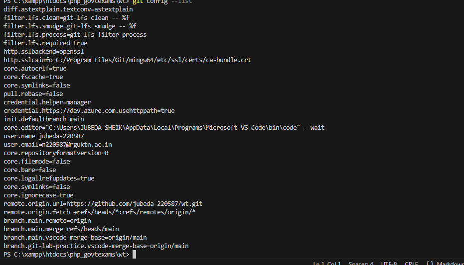

## Command: git config --global user.name

### Syntax:
git config --global user.name "Your Name"

### Purpose:
Sets or displays the global username used for Git commits.

### Example:
git config --global user.name

### Screenshot Proof:

## Command: git config --global user.email

### Syntax:
git config --global user.email "your-email@example.com"

### Purpose:
Sets or displays the global email used for Git commits.

### Example:
git config --global user.email

### Screenshot Proof:

git config --list
Displays all Git configuration settings
(username,email,core settings,etc).

git config --list

## Command: git config --unset

### Syntax:
git config --global --unset user.name

### Purpose:
Removes a specific Git configuration setting.

### Example:
git config --global --unset user.name

### Screenshot Proof:

## Command: git init
git init
Initializes a new Git repository in the current folder. Creates a .git folder to track changes.

git init

